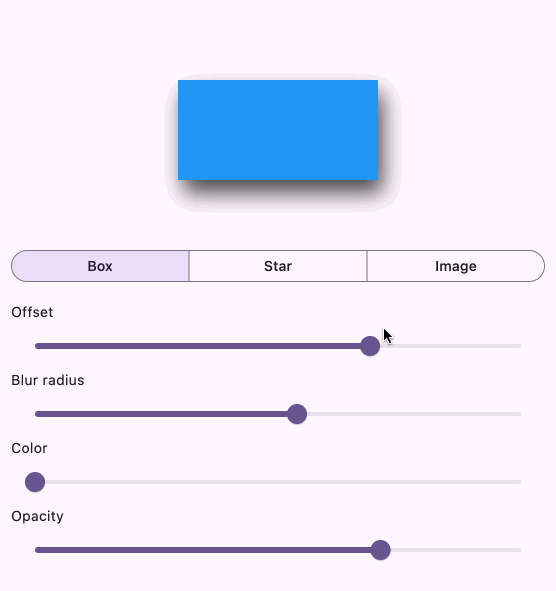

A widget that adds a shadow effect to any Flutter widget.



This widget in its original form comes from the [swift_ui](https://github.com/Flutter-Bounty-Hunters/swift_ui) package at [Flutter Bounty Hunters](https://github.com/Flutter-Bounty-Hunters).

## Usage

Wrap the widget that you want to add a shadow to with a `ShadowedWidget`.

```dart
ShadowWidget(
  offset: Offset(10, 10),
  color: Colors.black.withOpacity(0.5),
  blurRadius: 10.0,
  child: MyWidget(),
),
```

Notes:

- The shadow's opacity is independent of the child widget's opacity.
- A `blurRadius` of `0.0` is sharp while higher values are more fuzzy.

## Further development

Do you need a bug fixed or a feature added? Or do you need other specialized open-source widgets developed for your project? Hire someone at [Flutter Bounty Hunters](https://flutterbountyhunters.com/) or reach out to me directly.
